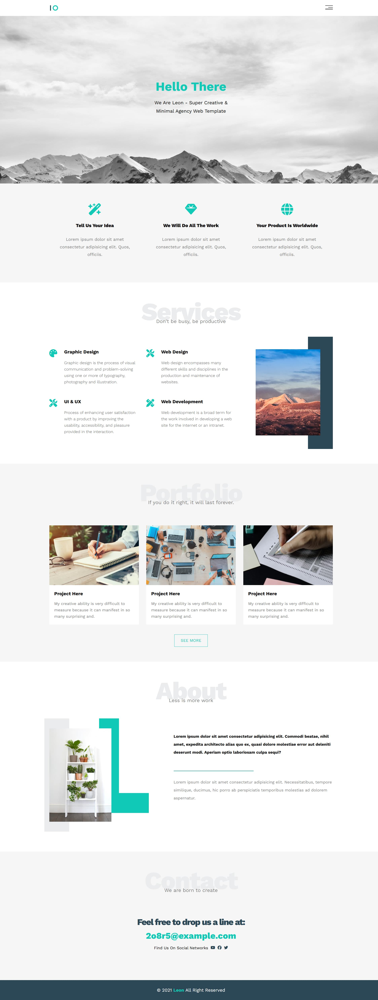

# Leon - Modern Landing Page Template

This is a responsive landing page template for a fictional creative agency, built from scratch using pure HTML5 and CSS3. This project is a key milestone in my intensive **100-day journey** to become a professional front-end developer.

**🚀 [Live Demo](https://karimmahmoud44.github.io/leon-landing-page/) 🚀**

---

## About The Project

"Leon" is a clean and modern landing page that I built as a practical application of my HTML and CSS skills. The main goal was to convert a static design into a fully functional and responsive website, focusing on mastering modern CSS layout techniques.

---

## ✨ Key Features

* **Responsive Design:** A mobile-first approach ensures the website looks great on all devices.
* **Advanced CSS Layouts:**
    * **CSS Grid** was used to structure the main multi-column layouts in the *Features*, *Services*, and *Portfolio* sections.
    * **Flexbox** was used for alignment and spacing in the *About* section and other smaller components.
* **CSS Variables:** Used for a consistent color palette and easy theme management.
* **Hover Effects & Transitions:** Smooth and subtle animations to improve user experience.
* **Font Awesome Icons:** Integrated for clean and scalable vector icons.

---

## 🛠️ Technologies Used

* **HTML5**
* **CSS3**
    * CSS Grid
    * Flexbox
    * CSS Custom Properties (Variables)
    * Media Queries

---

## 🧠 What I Learned

This project was a fantastic learning experience that helped me solidify my understanding of turning a design into code. Specifically, I gained practical experience in:

* Choosing the right tool for the job by using **CSS Grid** for complex, two-dimensional layouts and **Flexbox** for simpler, one-dimensional arrangements.
* Implementing a "mobile-first" workflow to ensure the design is fully responsive.
* Writing more maintainable and organized code by using **CSS Variables**.

---

## 🌱 Reflections & Future Focus

* **Emphasis on Semantic HTML:** While this project heavily utilized `
` tags for structure, it highlighted the importance of using semantic HTML5 tags (like `<section>`, `<nav>`, and `<header>`). Adopting a "semantic-first" approach will be a key priority in all my upcoming projects to ensure better accessibility and cleaner, more meaningful code.

---

## 🙏 Acknowledgements

* This project was built following the excellent tutorial by [Elzero Web School](https://www.youtube.com/@ElzeroWebSchool).
* The original design can be found here: [Leon Template PSD](https://www.graphberry.com/item/leon-psd-agency-template).
